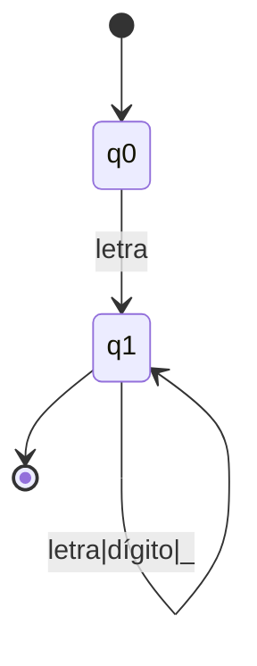
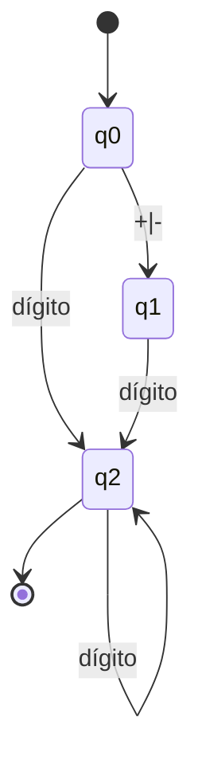
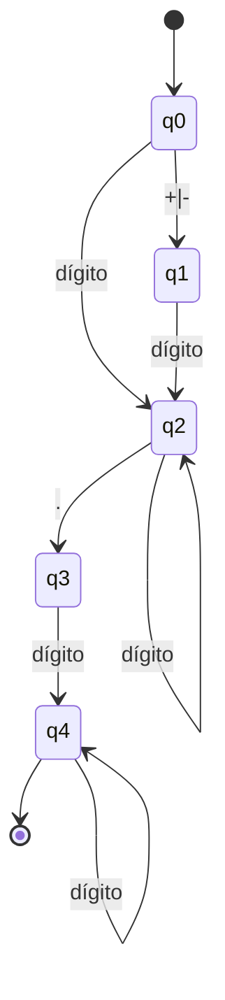
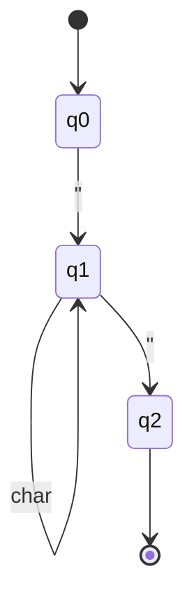
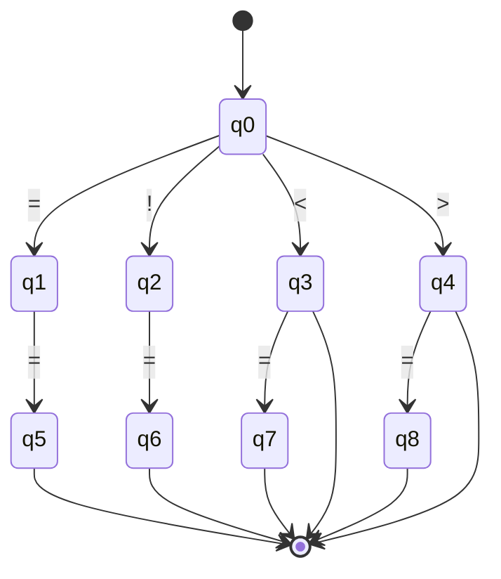
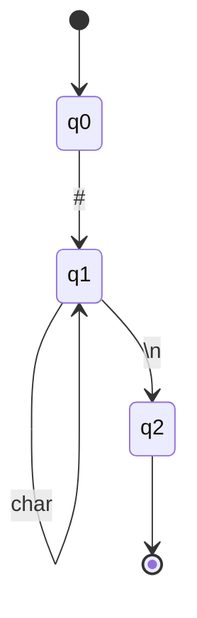

# AFDs - Linguagem Apollo

## 1. Identificadores

## 2. Números Inteiros

## 3. Números Reais

## 4. Strings

## 5. Operadores

## 6. Comentários

from enum import Enum
from typing import Dict, Set, Optional
import re

class TokenType(Enum):
    IDENTIFIER = "IDENTIFIER"
    KEYWORD = "KEYWORD"
    INTEGER = "INTEGER"
    REAL = "REAL"
    STRING = "STRING"
    OPERATOR = "OPERATOR"
    COMMENT = "COMMENT"
    SYMBOL = "SYMBOL"
    EOF = "EOF"

class Token:
    def __init__(self, type: TokenType, value: str, line: int = 1, column: int = 1):
        self.type = type
        self.value = value
        self.line = line
        self.column = column

class AFD:
    def __init__(self, states: Set[int], alphabet: Set[str], transitions: Dict, 
                 initial_state: int, final_states: Set[int], token_type: TokenType):
        self.states = states
        self.alphabet = alphabet
        self.transitions = transitions
        self.initial_state = initial_state
        self.final_states = final_states
        self.token_type = token_type
    
    def recognize(self, input_string: str) -> bool:
        current_state = self.initial_state
        for char in input_string:
            if (current_state, char) in self.transitions:
                current_state = self.transitions[(current_state, char)]
            else:
                return False
        return current_state in self.final_states

class IdentifierAFD(AFD):
    def __init__(self):
        keywords = {'algoritmo', 'fim_algoritmo', 'se', 'senao', 'enquanto', 
                   'para', 'faca', 'escreva', 'leia_numero', 'leia_texto',
                   'verdadeiro', 'falso', 'inteiro', 'real', 'texto', 'logico'}
        self.keywords = keywords
        super().__init__({0, 1}, set(), {}, 0, {1}, TokenType.IDENTIFIER)
    
    def recognize_and_classify(self, input_string: str) -> Optional[Token]:
        if not input_string:
            return None
        
        if not (input_string[0].isalpha() or input_string[0] in 'áàâãéèêíìîóòôõúùûç_'):
            return None
        
        for char in input_string[1:]:
            if not (char.isalnum() or char in 'áàâãéèêíìîóòôõúùûç_'):
                return None
        
        token_type = TokenType.KEYWORD if input_string.lower() in self.keywords else TokenType.IDENTIFIER
        return Token(token_type, input_string)

class IntegerAFD(AFD):
    def __init__(self):
        super().__init__({0, 1, 2}, set(), {}, 0, {2}, TokenType.INTEGER)
    
    def recognize_and_classify(self, input_string: str) -> Optional[Token]:
        if re.match(r'^[+-]?\d+$', input_string):
            return Token(TokenType.INTEGER, input_string)
        return None

class RealAFD(AFD):
    def __init__(self):
        super().__init__({0, 1, 2, 3, 4}, set(), {}, 0, {4}, TokenType.REAL)
    
    def recognize_and_classify(self, input_string: str) -> Optional[Token]:
        if re.match(r'^[+-]?\d+\.\d+$', input_string):
            return Token(TokenType.REAL, input_string)
        return None

class StringAFD(AFD):
    def __init__(self):
        super().__init__({0, 1, 2}, set(), {}, 0, {2}, TokenType.STRING)
    
    def recognize_and_classify(self, input_string: str) -> Optional[Token]:
        if len(input_string) >= 2 and input_string[0] == '"' and input_string[-1] == '"':
            return Token(TokenType.STRING, input_string)
        return None

class OperatorAFD(AFD):
    def __init__(self):
        operators = {'==', '!=', '<=', '>=', '<', '>', '=', '+', '-', '*', '/'}
        self.operators = operators
        super().__init__(set(), set(), {}, 0, set(), TokenType.OPERATOR)
    
    def recognize_and_classify(self, input_string: str) -> Optional[Token]:
        if input_string in self.operators:
            return Token(TokenType.OPERATOR, input_string)
        return None

class CommentAFD(AFD):
    def __init__(self):
        super().__init__({0, 1, 2}, set(), {}, 0, {2}, TokenType.COMMENT)
    
    def recognize_and_classify(self, input_string: str) -> Optional[Token]:
        if input_string.startswith('#'):
            return Token(TokenType.COMMENT, input_string)
        return None

class ApolloLexer:
    def __init__(self):
        self.identifier_afd = IdentifierAFD()
        self.integer_afd = IntegerAFD()
        self.real_afd = RealAFD()
        self.string_afd = StringAFD()
        self.operator_afd = OperatorAFD()
        self.comment_afd = CommentAFD()
        
        self.symbols = {'(', ')', ':', ','}
        
    def tokenize(self, source_code: str) -> list[Token]:
        tokens = []
        line = 1
        column = 1
        i = 0
        
        while i < len(source_code):
            if source_code[i].isspace():
                if source_code[i] == '\n':
                    line += 1
                    column = 1
                else:
                    column += 1
                i += 1
                continue
            
            token = self._match_token(source_code, i, line, column)
            if token:
                tokens.append(token)
                i += len(token.value)
                column += len(token.value)
            else:
                raise SyntaxError(f"Caractere inválido '{source_code[i]}' na linha {line}, coluna {column}")
        
        tokens.append(Token(TokenType.EOF, "", line, column))
        return tokens
    
    def _match_token(self, source: str, pos: int, line: int, column: int) -> Optional[Token]:
        if source[pos] == '#':
            end = source.find('\n', pos)
            if end == -1:
                end = len(source)
            comment_text = source[pos:end]
            return Token(TokenType.COMMENT, comment_text, line, column)
        
        if source[pos] == '"':
            end = pos + 1
            while end < len(source) and source[end] != '"':
                end += 1
            if end < len(source):
                end += 1
                string_text = source[pos:end]
                return Token(TokenType.STRING, string_text, line, column)
        
        if pos + 1 < len(source):
            two_char = source[pos:pos+2]
            if self.operator_afd.recognize_and_classify(two_char):
                return Token(TokenType.OPERATOR, two_char, line, column)
        
        if self.operator_afd.recognize_and_classify(source[pos]):
            return Token(TokenType.OPERATOR, source[pos], line, column)
        
        if source[pos] in self.symbols:
            return Token(TokenType.SYMBOL, source[pos], line, column)
        
        end = pos
        while end < len(source) and (source[end].isalnum() or source[end] in 'áàâãéèêíìîóòôõúùûç_.+-'):
            end += 1
        
        if end > pos:
            text = source[pos:end]
            
            if '.' in text:
                token = self.real_afd.recognize_and_classify(text)
                if token:
                    token.line = line
                    token.column = column
                    return token
            
            token = self.integer_afd.recognize_and_classify(text)
            if token:
                token.line = line
                token.column = column
                return token
            
            token = self.identifier_afd.recognize_and_classify(text)
            if token:
                token.line = line
                token.column = column
                return token
        
        return None

def test_afds():
    lexer = ApolloLexer()
    
    assert lexer.identifier_afd.recognize_and_classify("nome").type == TokenType.IDENTIFIER
    assert lexer.identifier_afd.recognize_and_classify("algoritmo").type == TokenType.KEYWORD
    
    assert lexer.integer_afd.recognize_and_classify("42").type == TokenType.INTEGER
    assert lexer.real_afd.recognize_and_classify("3.14").type == TokenType.REAL
    
    assert lexer.string_afd.recognize_and_classify('"Hello"').type == TokenType.STRING
    
    assert lexer.operator_afd.recognize_and_classify("==").type == TokenType.OPERATOR
    assert lexer.operator_afd.recognize_and_classify("<=").type == TokenType.OPERATOR
    
    assert lexer.comment_afd.recognize_and_classify("# comentário").type == TokenType.COMMENT
    
    print("Todos os testes passaram!")

if __name__ == "__main__":
    test_afds()
    
code = '''algoritmo exemplo
    inteiro numero1, numero2
    escreva("Digite um número:")
    numero1 = leia_numero()
    se numero1 >= 10 faca
        escreva("Número grande!")
    fim_algoritmo'''
