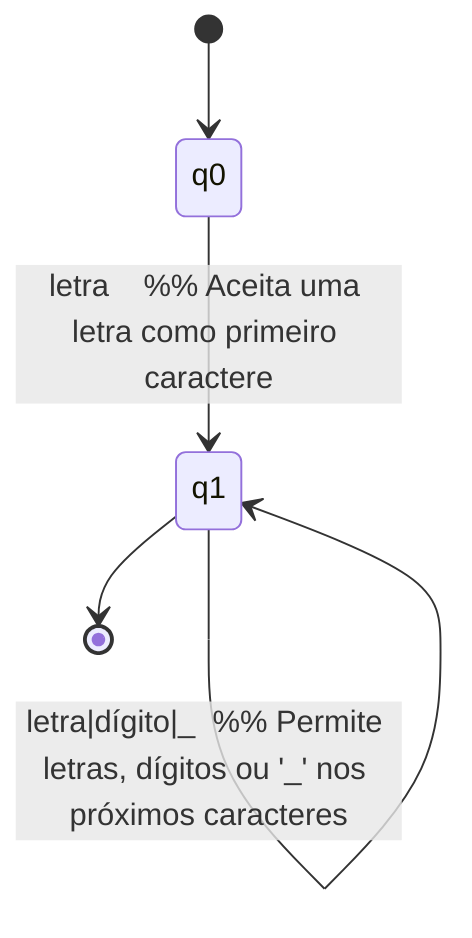
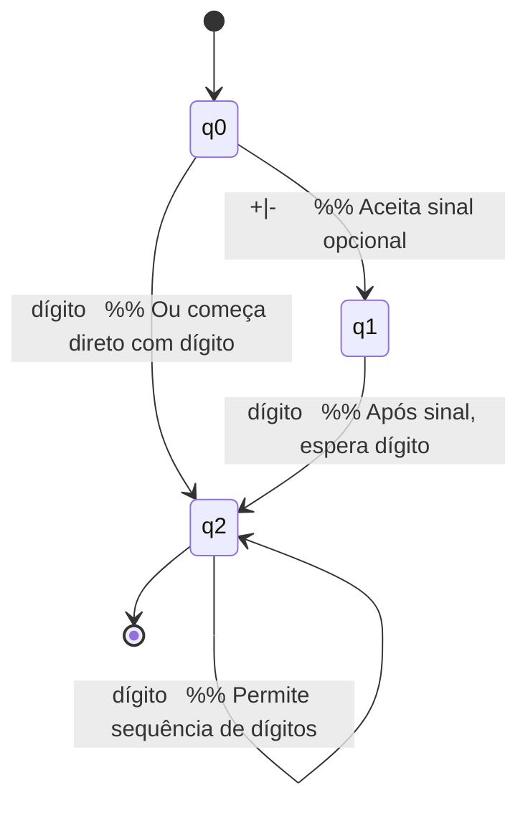
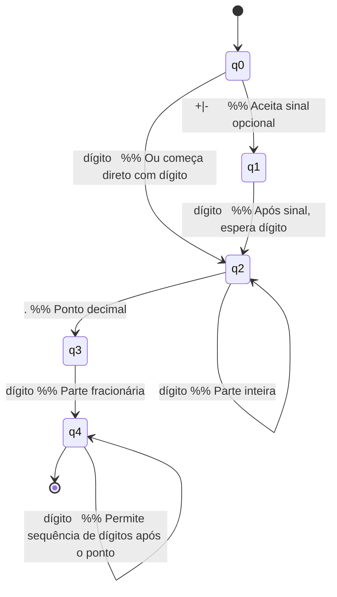
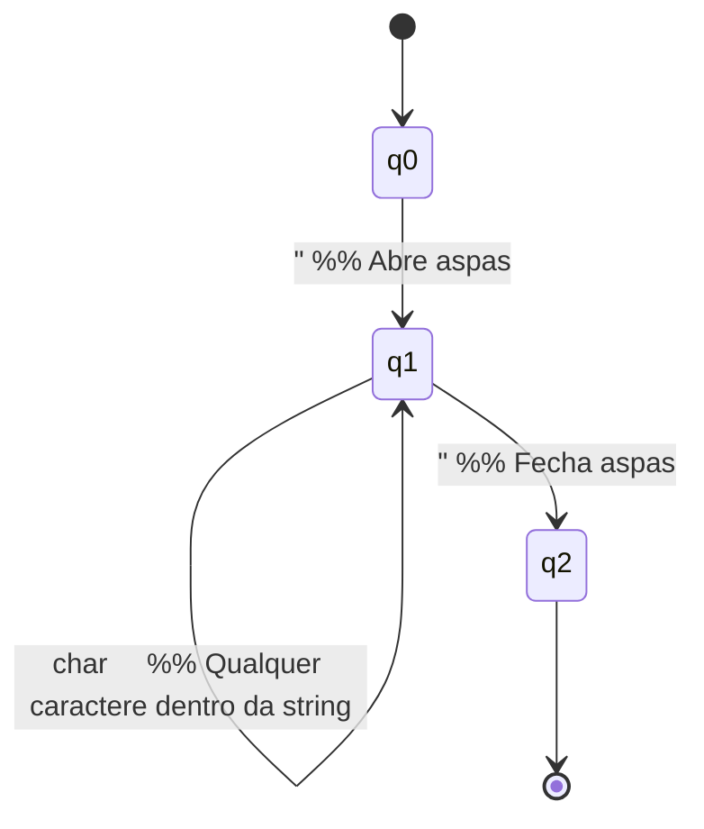
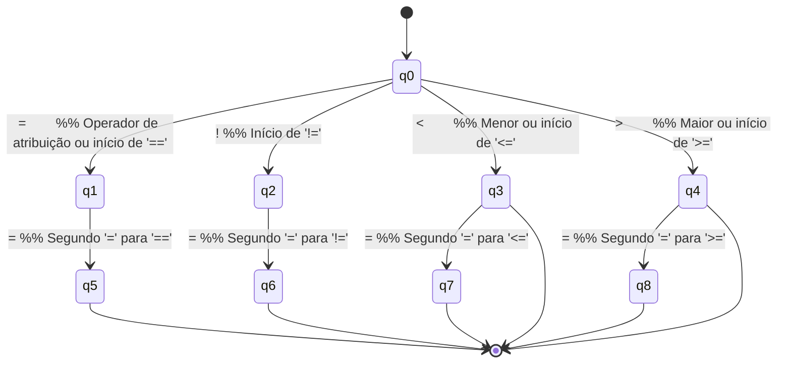
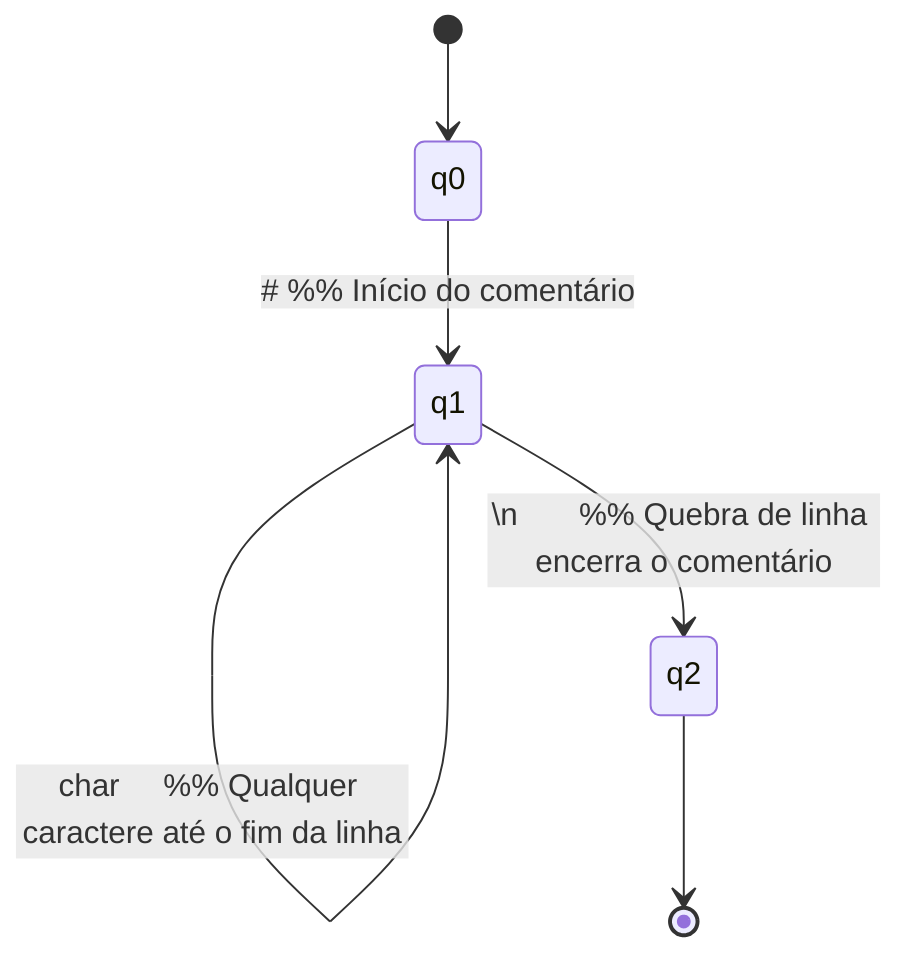

# AFDs - Linguagem Apollo

## 1. Identificadores

```mermaid
stateDiagram-v2
    [*] --> q0           %% Início do autômato
    q0 --> q1 : letra    %% Aceita uma letra como primeiro caractere
    q1 --> q1 : letra|dígito|_  %% Permite letras, dígitos ou '_' nos próximos caracteres
    q1 --> [*]           %% Estado final (identificador reconhecido)
```

## 2. Números Inteiros

```mermaid
stateDiagram-v2
    [*] --> q0           %% Início do autômato
    q0 --> q1 : +|-      %% Aceita sinal opcional
    q0 --> q2 : dígito   %% Ou começa direto com dígito
    q1 --> q2 : dígito   %% Após sinal, espera dígito
    q2 --> q2 : dígito   %% Permite sequência de dígitos
    q2 --> [*]           %% Estado final (inteiro reconhecido)
```

## 3. Números Reais

```mermaid
stateDiagram-v2
    [*] --> q0           %% Início do autômato
    q0 --> q1 : +|-      %% Aceita sinal opcional
    q0 --> q2 : dígito   %% Ou começa direto com dígito
    q1 --> q2 : dígito   %% Após sinal, espera dígito
    q2 --> q2 : dígito   %% Parte inteira
    q2 --> q3 : .        %% Ponto decimal
    q3 --> q4 : dígito   %% Parte fracionária
    q4 --> q4 : dígito   %% Permite sequência de dígitos após o ponto
    q4 --> [*]           %% Estado final (real reconhecido)
```

## 4. Strings

```mermaid
stateDiagram-v2
    [*] --> q0           %% Início do autômato
    q0 --> q1 : "        %% Abre aspas
    q1 --> q1 : char     %% Qualquer caractere dentro da string
    q1 --> q2 : "        %% Fecha aspas
    q2 --> [*]           %% Estado final (string reconhecida)
```

## 5. Operadores

```mermaid
stateDiagram-v2
    [*] --> q0           %% Início do autômato
    q0 --> q1 : =        %% Operador de atribuição ou início de '=='
    q0 --> q2 : !        %% Início de '!='
    q0 --> q3 : <        %% Menor ou início de '<='
    q0 --> q4 : >        %% Maior ou início de '>='
    q1 --> q5 : =        %% Segundo '=' para '=='
    q2 --> q6 : =        %% Segundo '=' para '!='
    q3 --> q7 : =        %% Segundo '=' para '<='
    q3 --> [*]           %% Menor
    q4 --> q8 : =        %% Segundo '=' para '>='
    q4 --> [*]           %% Maior
    q5 --> [*]           %% '=='
    q6 --> [*]           %% '!='
    q7 --> [*]           %% '<='
    q8 --> [*]           %% '>='
```

## 6. Comentários

```mermaid
stateDiagram-v2
    [*] --> q0           %% Início do autômato
    q0 --> q1 : #        %% Início do comentário
    q1 --> q1 : char     %% Qualquer caractere até o fim da linha
    q1 --> q2 : \n       %% Quebra de linha encerra o comentário
    q2 --> [*]           %% Estado final (comentário ignorado)
```
