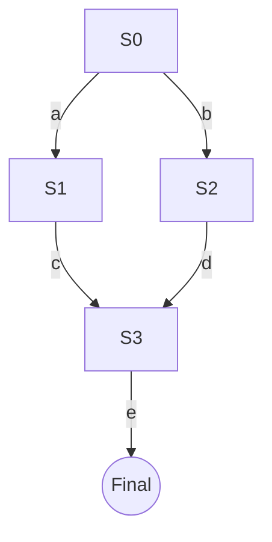

# Diagrama Mermaid do AFD Final

```mermaid
graph TD
    %% Exemplo de estados e transições
    S0 -->|a| S1
    S0 -->|b| S2
    S1 -->|c| S3
    S2 -->|d| S3
    S3 -->|e| S4
    S4((Final))
```

<!-- Substitua os estados e transições acima pelo seu AFD gerado -->
